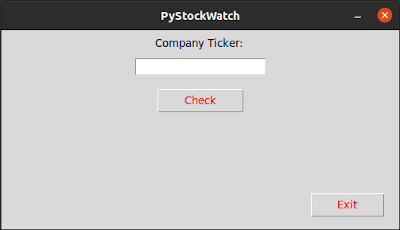
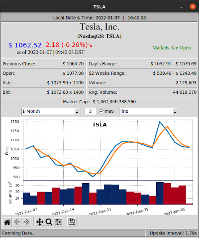
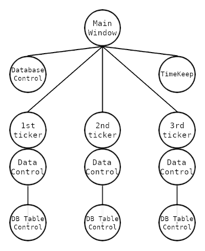

# __PyStockWatch - GUI Stock Watch__
## Final project for CS50 course.
### Video: https://youtu.be/28Dy55jom-M
## Description:
PyStockWatch is a GUI program that displays stock exchange data on given ticker(s) in a neat display with a customizable plot graph of the stock historical data.

## Introduction:
The program is written in python(3.x) using The tkinter package (“Tk interface”) for the GUI components, implemented with OOP style and concepts, with focus on backend functionality to be light and separately dependant on class hierarchy.

## Features:
- Debug messages: Terminal will display informative(?) messages as to what's going on behind the scenes.

#### Main Window:
- Ticker Auto complete: Ticker entry field can be used to search for a company by ticker or name, it will actively display and update suggestions for available tickers that match the user input.
- Multi-Ticker Display: Ticker entry field can take a single ticker (e.g. "MSFT"), or multiple tickers separated by a space (e.g. "MSFT AMZN AAPL NVDA"), and display a window for each one.

#### Symbol Window:
- Price Auto Update: The program will automatically retrieve and update stock data as long as the market is open.
- Auto Pause and Continue: The program keeps a time table to pause data retrieval on market close time, and continue on market open time.
- Price change indicator: Price will flash green or red depending on the most recent price change.
- Comprehensive(?) Data table: The ticker window will display the following data set:
    - Previous close price
    - Open price
    - Ask (price x size)
    - Bid (price x size)
    - Day's range(low - high)
    - 52 Weeks' range(low - high)
    - Day's volume
    - Avg. volume.
- Customizable graphic data plot of historical data:
    - Period control:
        - Several pre-set periods
        - Custom period entry [from]:[to]
    - Moving average line (enable/disable/set)
    - plot line style (line/candle/ohlc)

## Installation:
### Get the code and install dependencies:
```
$ git clone https://github.com/MoeR3za/PyStockwatch.git
$ cd PyStockWatch
$ pip3 install -r requirements.txt
```
### Run the program:
```
$ python3 PyStockWatch.py
```
or to disable debug messages
```
$ python3 PyStockWatch.py silent
```



### Enter a company ticker in the field and press the Check button.



## Technical details:
The program is build entirely with OOP concepts in mind, split into classes, it maintains semi-central control over display windows to keep each object in the hierarchy tree separate but with access to passed-down central time and database control objects, as in the following horrible monstrosity of a diagram:-



## Files and descriptions (Ordered by usage)[^note]:
[^note]:
    Note: For _specific_ details on each class and its method, I have included sufficient(hopefully) documentation on each class and method in every file.

- ### PyStockWatch.py:
    The main "__main\__" program execution file. when launched will open the main window of the program, that initializes a time-keep object that contains an engine that constantly updates a time table, and a database connection object with attributes of a connection to the database and a session creator. Both objects are then passed down to each Symbol Window objects, that in turn pass them down to Data Control objects where the database control object is used to control the symbol table in the database, and where the TimeKeep object is used for.. well.. timekeeping.. therefore maintain a single connection between all program components and the database through scoped sessions, and a single source of time updates.

- ### StockWatch/..:
    __StockWatch__ is a package that is imported by "__main\__", it contains several python libraries used in the program as the following details:-
    - ### __init\_\_.py:
        Initializes package: basically imports only what "__main\__" needs to function.
    - ### _time_control.py:
        Contains class __TimeKeep__, creates an object that keeps track of time and date, it has attributes of time and date whose values keep updating. Initialized by "__main\__" and used across the program as a central source of time and date.
    - ### _db_control.py:
        Contains Classes __MainControl__ and __TableControl__:-
        - class __MainControl__ used by PyStockWatch, it initializes the database connection and creates an object that acts as a central connection point to the database. It also contains local classes __Symbols__ and __Logger__.
            - __Symbols__ class maintains symbols table in the database, mainly used in "__main\__" to validate user input and display corresponding matches of inputs.
            - __Logger__ class maintains logs table, it is currently used to log when the symbols table was accessed, which is later used to decide if the symbols table needs an update.
        - class __TableControl__ used by __DataControl__, given an instance of __MainControl__, to read, write, and update data to and from its symbol table in the database using scoped sessions.
    - ### _sym_window.py:
        Contains class __DisplayWindow__ that is responsible for the display of the symbol display window, this class inherits class __DataControl__ from _data_control.py.
    - ### _data_control.py:
        Contains class __DataControl__. Intended to to be inherited by class __DisplayWindow__, it is designed to be a controller of the data retrieval and display in the display window. After its initialization in a __DisplayWindow__ object given _self_ as _self_, a call to its start_engine() method is required to start the time and data generators.
    - ### _plot_graph.py:
        Contains class __PlotGraph__, used by instances of __DisplayWindow__ to display a graphic plot of its data, as well as a toolbar for control over the graph to be customizable.
        ##### [I was torn between including the plot function in DisplayWindow and putting it in a separate class, I decided on separation as I believe is a better structure, and easier to design and add more features in the future.]
    - ### _helper_toolbox.py:
        Contains miscellaneous classes used mainly in classes that display tkinter widgets to add additional features.
        - __Link__ : creates a linked tkinter label widget.
        - __ToolTip__: creates a floating tkinter label that spawns when mouse hovers over a given widget.
        - __AutoComplete__: creates the auto-complete dropdown list on user input, given an entry widget and a symbols dataframe.


<!-- 
This little project is my baby, the heart of my learning curve, even a partner in a beautiful journey of several months of continuous learning, and I am proud of it. It started with printing the stock price in a loop on the same line in the terminal, and evolved to become what it is today. step by step and feature by feature, the transition from functional to OOP, I learned a lot along the way, and it is also why any inspector of the code will notice that some parts of the code are more advanced than some others that can be implemented much better than they currently are.

CS50x played an undeniable role in this journey, it is true that it did not teach me programming but how to think like a programmer. That alone was my giant leap on this track. I am very grateful I was introduced to this course, and thankful to David, Doug, Brian and the rest of the staff for their beautiful and undisputable efforts.

I cannot say I have learned just enough yet, and I'm sure there are several minor(?) bugs or edge cases I may have missed, but I will continue using this piece of software as a training ground to enhance, optimize, upgrade, and add more features to it, hopefully, with better knowledge and more experience.
 -->
